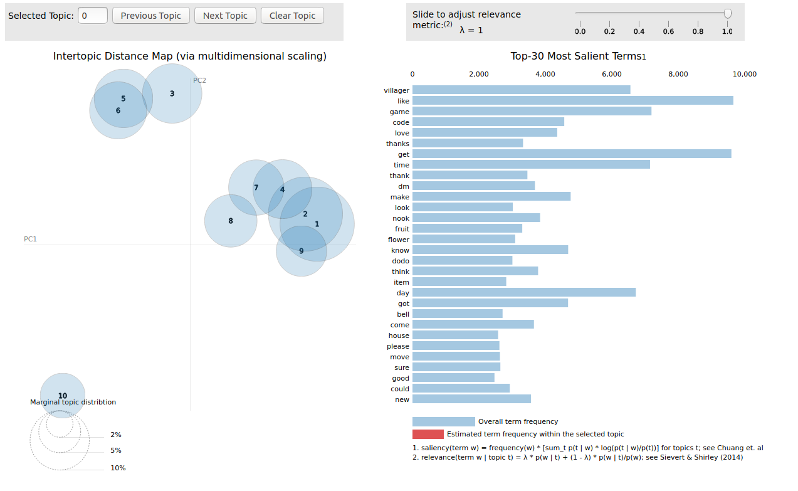
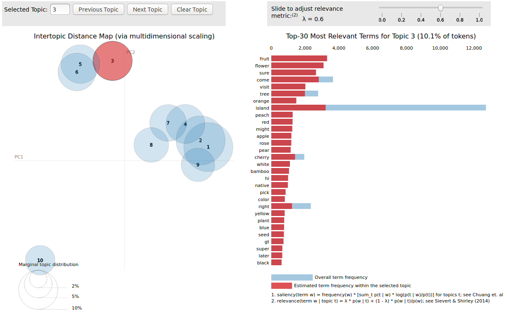
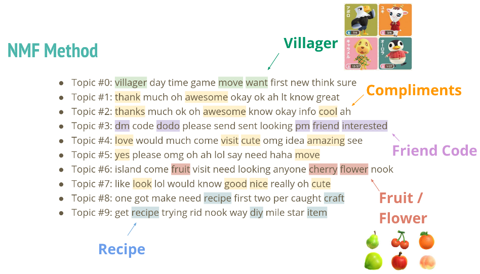

# Wholesome Possum
# NLP Analysis of the Animal Crossing Subreddit


####  for a 3-minute summary presentation 

# Table of Contents
<!--ts-->
1. [Background](#background)
2. [Motivation](#motivation)
3. [Data](#data) 
4. [Exploratory Analysis](#exploratory-analysis)
    * [KMeans](#kmeans)
    * [LDA](#lda)
    * [NMF](#nmf)
5. [Use Case](#use-case)
    * [Pre-Launch](#pre-launch)
    * [Launch](#launch)
6. [Conclusion](#conclusion)
7. [Future work](#future-work)
8. [Credits](#credits)
<!--te-->

## **Background**
Animal Crossing: New Horizons is the fifth installment of the Animal Crossing Series. After years of development, it was released on March 20th, 2020, in the midst of a global pandemic.
<br/><br/>
It could not have come at a better timing: shelter-in-place means ample free time, and there was a lack of new game releases from other major competitors. It sold over 11M copies in six weeks according to Nintendo's recent [financial release](https://www.nintendo.co.jp/ir/pdf/2020/200507e.pdf), and it is projected to be the best-selling installment in the franchise history.
<br/><br/>
So what is Animal Crossing? It is a social-simulation game. There is no shooting or fighting monsters (unless you count tarantula and wasps). Instead, you are fishing, catching insects, and developing a deserted island into your own tropical paradise. It is the embodiment of escapisim when the world around us is crumbling down.


<br/>

## **Motivation**
Due to the nature of the game, the Animal Crossing community is often described as being "wholesome". In contrast, other video games with competitive elements are often associated with a "toxic" online environment, where the dominant topics are complaints or heated debates.
<br/><br/>
As a data scientist who frequents various Animal Crossing online communities (Twitter, Reddit, etc), I wanted to check on my rose-colored glasses. Hence, I set out to find some answers:
1. How wholesome is the Animal Crossing community? 
2. What are some hot topics?

## **Data**
I decided to focus on the Animal Crossing subreddit. It has over a million subscribers and a high volume of traffic, so there is plenty of data. The first hurdle was that Reddit removed the functionality to query by timestamp from their official API some years ago. Fortunately, there is a workaround with [pushshift.io](https://pushshift.io/) API, which allowed me to obtain ~2 million comments from the subreddit between March 13, 2020 (a week before launch) and May 10, 2020. See the get_data notebook for an example of how to query through the API.
<br/>

<br/><br/>
The subreddit averaged roughly 40k comments a day since launch. Recently it has been trending downward, either due to the excitment wearing off, or simply the lack of event. It remains to be seen if it surges again when the next major update is released in the future.
<br/>


## **Exploratory Analysis**
As part of my EDA, I decided to deploy the [VADER](https://github.com/cjhutto/vaderSentiment) tool to process the raw text comments. Part of the charm was its ability to recognize "speech" pattern on social media such as emoji, emoticon, and intensity based on punctuation (e.g. THIS!!!!), which the traditional natural language processing (NLP) toolkits lack. 
<br/><br/>
Using the recommended classification setting, I categorized comments with a compound sentiment score >= 0.05 to be positive, < 0.05 and > -0.05 to be neutral, and <= -0.05 to be negative
<br/><br/>
Below is the distribution of the compound sentiment score. Many comments cluster around 0 with a slight positive leaning 

<br/><br/>
The sentiment trend since launch has been mostly positive, with a gradual increase in the proportion of positive comments

<br/><br/>
Just for fun, I decided to build a wordcloud of the 10k most positive comments, and the 10k most negative comments. See if you can tell which is which. Hint: the negative one has more curse words
<br/>


<br/><br/>

## **Topic Modeling**
There are a few ways to perform topic modeling, I used the following 3: Kmeans clustering (kmeans), Latent Dirichlet Allocation (LDA), Non-matrix Factorization (NMF).
<br/><br/>
I quickly realized that the generative approach with kmeans and LDA were not possible to run on my local machine. The massive document size (~2M) and feature count (100k+) would take long to process even on a memory-focus AWS EC2 instance, and there was a chance that the result would not be useful. Hence I had to scale down the document size and maximum feature in order to get some results.
<br/><br/>
### **kmeans**
The following are the top 10 topics and their top 10 keywords, obtained from a sample of 500k comments and limiting to 1k features. I put similar topics together for readability. 
<br/><br/>
These topics are discussions about the animal villagers
<br/>

```
Topic #0: want anyone island get one game make really know come people villager move time like
Topic #1: island villager get move day time mystery first got new nook visit plot house game
Topic #7: like look would game feel really people get something time make island thing villager know
Topic #8: one day get got villager time island first like make game think need new know
```

<br/>

The following topics are people complimenting each other on their island design or cloth design

```
Topic #4: love would much come cute visit omg island look see villager lol great idea get
Topic #6: thank much oh okay awesome ok know ah great amazing lt good omg appreciate haha
Topic #9: thanks get game time day got lol yes know need think make oh would good
```
<br/>

The following topics are about people exchanging friend codes to visit each island

```
Topic #2: dm looking fruit cherry orange peach apple pear native island anyone need flower bring shop
Topic #3: please dm yes code looking come island anyone let visit would need tip pm could
Topic #5: code dodo dm friend send qr island pm come open looking please visit shop new
```

<br/>

### LDA
LDA is a popular method for topic modeling. It allows for a handy visualization using [LDAvis](https://github.com/cpsievert/LDAvis)
<br/>
<br/>
The following is an LDAvis visualization generated from the model using 100k comments and 1k features (see [here](https://htmlpreview.github.io/?https://github.com/tchleung/Wholesome_Possum/blob/master/html/ldavis_100k.html) for the html):

<br/>
<br/>
Each bubble represents a latent topic in the model, and their sizes are proportional to how "big" is the topic amongst the comments. Clicking at each bubble shows the top 30 keywords, adjustable by relevance metric (lambda slider at the top right).
<br/>
Here is topic 3. It seems to be about fruits and flowers in the game.


### NMF
Another topic modeling method is using NMF. It had the fastest computing time comparing to kmeans and LDA.
<br/>
<br/>
Here are the top 10 topics from the NMF model:

<br/>
There are some distinct topics about villagers, exchanging friend code, fruits, and crafting recipe.
However, a number of them are quite similar to each other (compliments)

## Use Case

How do we make use of the data? Using a combination of sentiment and topic modeling can help us identify potential issues or feedbacks that we may not be aware of.
<br/>
<br/>
Let us drill down into the negative comments prior to launch

### Pre-launch

<br/>
<br/>
Some of the topics that NMF revealed were regarding potential shipment issue, price, and a game design choice (one island per console)
<br/>

<br/>
These could be valuable information to Nintendo's logistics, sales team, and the development team.

### Launch
I also focused on the week after launch by sentiment. Each "group" of comments reveal some different topics.
<br/>
<br/>
The positive comments over this period are consistent with the overall comment pool:
<br/>

<br/>
<br/>
The neutral comments contained the keyword `hemisphere`, where players were looking for fishes or bugs that were only available in the other hemisphere
<br/>

<br/>
<br/>
The negative comments were the most revealing; some players seemed to have network issues, while some others had complaints about the mystery island and tools mechanics
<br/>


## **Conclusion**

- The Animal Crossing subreddit is indeed wholesome possum! <br/>
The community sentiment has been positive, and the most common topics are compliments given to each other
<br/><br/>
- Unsupervised learning is awesome! <br/>
NLP techniques may not give out predictions, but it still provides useful information. Its application is not limited to games and reddit, but virtually any products & services that have an online presence
<br/><br/>
- Not all sunshine and rainbow <br/>
One drawback is the lack of useful accuracy metric. Computation speed aside, there is no objective measurement that can determine if kmeans, LDA or NMF is better
<br/><br/>
- Regarding interpretability <br/>
Without domain knowledge, all the keywords are total gibberish <br/>
Someone who has never played Animal Crossing may misinterpret the `bug` keyword, thinking that it is a game-breaking bug, when it is really about butterflies and beetles in the game 

## **Future Work**
Some ideas for future work
- Expand to cover additional platforms such as Twitter/Facebook
- Apply to other products/services
- Pipeline to pull comments in real-time, then label with sentiment, so it can have a rolling 24-hour or 7-day sentiment tracker

## **Tools**


## **Credits**
All Animal Crossing imageries from Google image search, all rights belong to Nintendo
Subreddit comments queried using Pushshift.io
Sentiment analysis package - VADER
LDA Model Visualization - LDAvis
